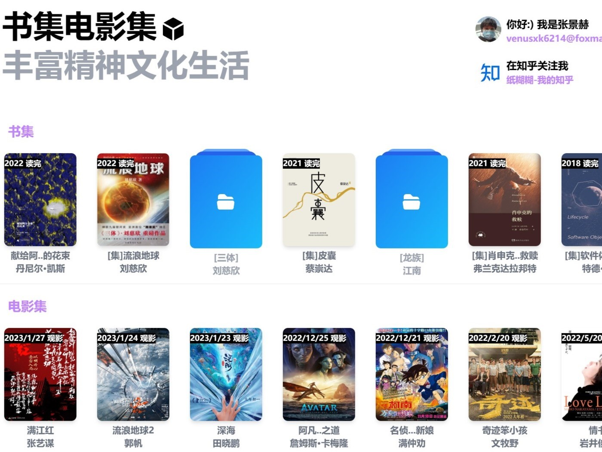

### 你好！我是张景赫，目前在中国石油大学（华东）念书，欢迎访问我的网站 (www.venusxk.com)
### Nihao! My name is Jinghe Zhang, currently studying at China University of Petroleum (East China), welcome to my website (www.venusxk.com)
- 😋 喜欢艺术，目前在学习Blender的建模、雕刻等知识，喜欢绘画；
- 😋 I like art, and I am currently learning Blender's modeling, sculpting and other knowledge, and I like painting;
- 🧑🏽‍💻 目前主要事情是准备考研，在学习408和数学知识；
- 🧑🏽‍💻 At present, the main thing for me is to prepare for graduate school, with studying programming and some mathematical knowledge;
- 📨 我的邮箱是 venusxk6214@foxmail.com，有需要可以联系我；
- 📨 My email address is venusxk6214@foxmail.com, you can contact me if you need it;

### 最近在 `github` 上的更新 &nbsp; Recent update on github

 

    

[My-Books-and-Film-Gallery](https://github.com/VenusXK/My-Books-and-Film-Gallery)

<!--
**VenusXK/VenusXK** is a ✨ _special_ ✨ repository because its `README.md` (this file) appears on your GitHub profile.

Here are some ideas to get you started:

- 🔭 I’m currently working on ...
- 🌱 I’m currently learning ...
- 👯 I’m looking to collaborate on ...
- 🤔 I’m looking for help with ...
- 💬 Ask me about ...
- 📫 How to reach me: ...
- 😄 Pronouns: ...
- ⚡ Fun fact: ...
-->
